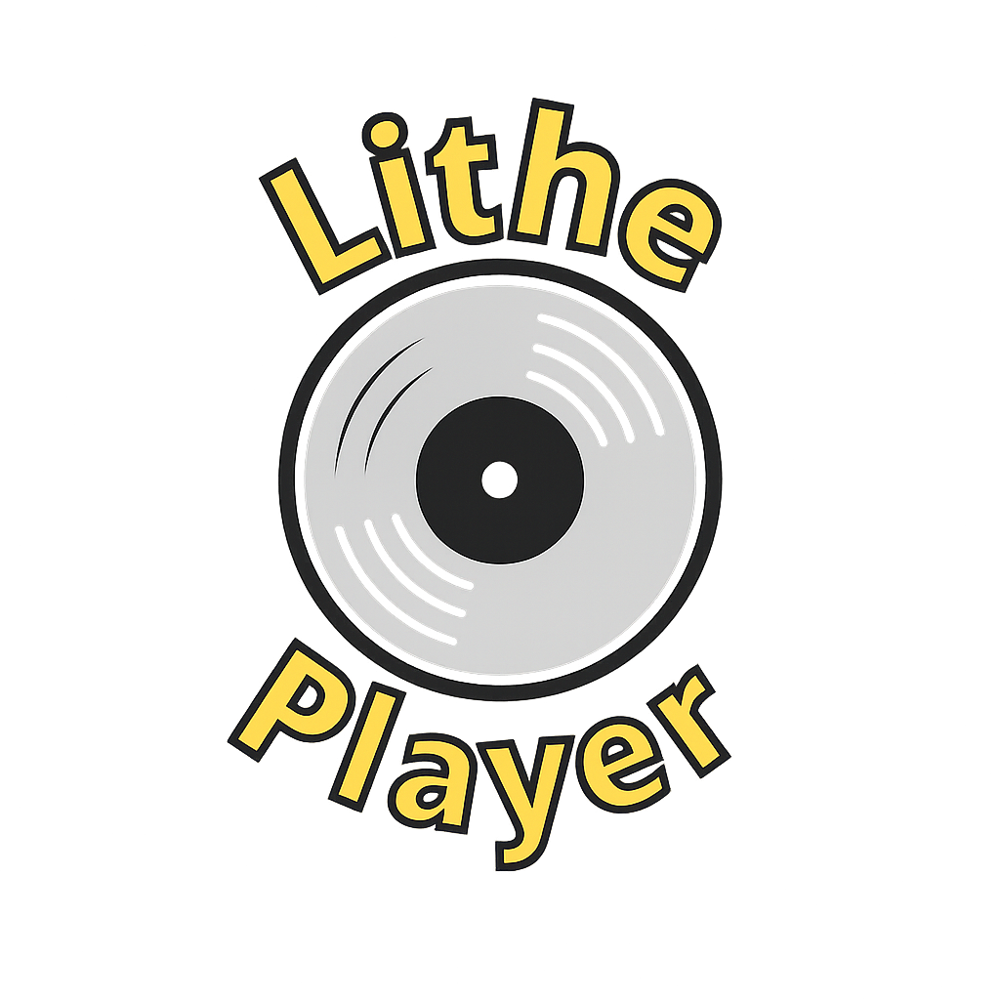
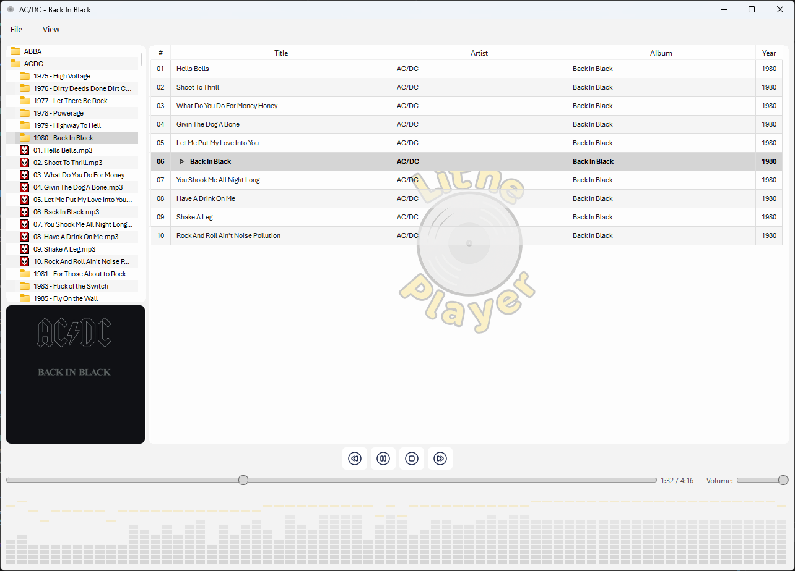

# 🎵 Lithe Player

<p align="center">
  
</p>

<p align="center">
  <strong>A modern, lightweight audio player with real-time FFT equalizer visualization</strong>
</p>

<p align="center">
  <a href="https://www.python.org/downloads/"></a>
  <a href="https://pypi.org/project/PySide6/"></a>
  <a href="LICENSE"></a>
</p>

---

## ✨ Features

### 🎼 Audio Playback
- **Gapless Playback** - Seamless transitions between tracks using dual-player architecture
- **Multi-format Support** - MP3, FLAC, WAV, M4A, AAC, and OGG
- **VLC Backend** - Reliable, high-quality audio engine
- **Playlist Management** - Queue and organize your music

### 🎨 Visual Experience
- **Real-time FFT Equalizer** - Beautiful frequency spectrum visualization with gravity physics
- **Album Art Display** - Automatic extraction and display of embedded artwork
- **Customizable Accent Colors** - Personalize the interface to match your style
- **Peak Hold Indicators** - Dynamic peak visualization with customizable colors and transparency
- **Smooth Animations** - Fluid, responsive equalizer with intelligent scaling

### 🎹 Control & Navigation
- **File Browser** - Intuitive directory navigation with album art preview
- **Global Media Keys** - Windows media key support (Play/Pause, Stop, Next, Previous)
- **Keyboard Shortcuts** - Spacebar, arrow keys, and standard media controls
- **Seek & Volume Controls** - Precise playback positioning and volume adjustment

### 🎯 Customization
- **Font Selection** - Customize playlist and directory browser fonts
- **Color Themes** - Set custom accent colors for highlights and equalizer
- **Peak Indicator Options** - Adjust color and transparency of peak indicators
- **Layout Persistence** - Window size, splitter positions, and settings are saved

---

## 📦 Installation

### Prerequisites

- **Python 3.8 or higher**
- **VLC Media Player** (libraries required)

### Step 1: Clone the Repository

```bash
git clone https://github.com/grahameys/lithe-player.git
cd lithe-player
```

### Step 2: Install Dependencies

```bash
pip install -r requirements.txt
```

### Step 3: VLC Setup

You have two options for VLC setup: **System Installation** (recommended for most users) or **Portable Deployment** (for standalone distribution).

#### Option A: System Installation (Recommended)

##### Windows
1. Download and install [VLC Media Player](https://www.videolan.org/vlc/) (3.0.0 or higher)
2. Install to the default location (`C:\Program Files\VideoLAN\VLC\`)
3. The application will automatically locate VLC libraries
4. Run the application - it will use your system VLC installation

##### macOS
```bash
brew install vlc
```

##### Linux
```bash
# Ubuntu/Debian
sudo apt-get install vlc libvlc-dev

# Fedora
sudo dnf install vlc vlc-devel

# Arch
sudo pacman -S vlc
```

#### Option B: Portable Deployment (Advanced)

For creating a standalone/portable version without requiring system VLC installation:

##### Step 1: Create Plugins Folder

Create a `plugins` folder in the same directory as `lithe_player.py`:

```bash
mkdir plugins
```

##### Step 2: Locate VLC Installation

Find your VLC installation directory:
- **Windows**: Typically `C:\Program Files\VideoLAN\VLC\`
- **macOS**: `/Applications/VLC.app/Contents/MacOS/`
- **Linux**: `/usr/lib/vlc/` or `/usr/lib/x86_64-linux-gnu/vlc/`

##### Step 3: Copy Required Files

You need to copy **core VLC libraries** and **plugin DLLs** to your `plugins` folder.

###### Windows - Required Files

Copy these files from your VLC installation to the `plugins` folder:

**Core Libraries** (from VLC root directory):
```
libvlc.dll
libvlccore.dll
```

**Audio Codec Plugins** (from VLC `plugins\codec\` directory):
```
libavcodec_plugin.dll
libfaad_plugin.dll
libflac_plugin.dll
libmpg123_plugin.dll
libopus_plugin.dll
libtaglib_plugin.dll
```

**Demuxer Plugins** (from VLC `plugins\demux\` directory):
```
libflacsys_plugin.dll
libmp4_plugin.dll
libogg_plugin.dll
librawaud_plugin.dll
libwav_plugin.dll
```

**Access Plugins** (from VLC `plugins\access\` directory):
```
libfilesystem_plugin.dll
```

**Audio Output Plugins** (from VLC `plugins\audio_output\` directory):
```
libdirectsound_plugin.dll
libwaveout_plugin.dll
```

**Miscellaneous** (from VLC `plugins\logger\` directory):
```
liblogger_plugin.dll
```

**Total: 19 files (~24 MB)**

###### Quick Copy Script (Windows PowerShell)

Save this as `copy-vlc-plugins.ps1` and run from the Lithe Player directory:

```powershell
# Set VLC installation path
$vlcPath = "C:\Program Files\VideoLAN\VLC"

# Create plugins folder
New-Item -ItemType Directory -Force -Path "plugins"

# Copy core libraries
Copy-Item "$vlcPath\libvlc.dll" -Destination "plugins\"
Copy-Item "$vlcPath\libvlccore.dll" -Destination "plugins\"

# Copy codec plugins
Copy-Item "$vlcPath\plugins\codec\libavcodec_plugin.dll" -Destination "plugins\"
Copy-Item "$vlcPath\plugins\codec\libfaad_plugin.dll" -Destination "plugins\"
Copy-Item "$vlcPath\plugins\codec\libflac_plugin.dll" -Destination "plugins\"
Copy-Item "$vlcPath\plugins\codec\libmpg123_plugin.dll" -Destination "plugins\"
Copy-Item "$vlcPath\plugins\codec\libopus_plugin.dll" -Destination "plugins\"
Copy-Item "$vlcPath\plugins\codec\libtaglib_plugin.dll" -Destination "plugins\"

# Copy demuxer plugins
Copy-Item "$vlcPath\plugins\demux\libflacsys_plugin.dll" -Destination "plugins\"
Copy-Item "$vlcPath\plugins\demux\libmp4_plugin.dll" -Destination "plugins\"
Copy-Item "$vlcPath\plugins\demux\libogg_plugin.dll" -Destination "plugins\"
Copy-Item "$vlcPath\plugins\demux\librawaud_plugin.dll" -Destination "plugins\"
Copy-Item "$vlcPath\plugins\demux\libwav_plugin.dll" -Destination "plugins\"

# Copy access plugins
Copy-Item "$vlcPath\plugins\access\libfilesystem_plugin.dll" -Destination "plugins\"

# Copy audio output plugins
Copy-Item "$vlcPath\plugins\audio_output\libdirectsound_plugin.dll" -Destination "plugins\"
Copy-Item "$vlcPath\plugins\audio_output\libwaveout_plugin.dll" -Destination "plugins\"

# Copy logger plugin
Copy-Item "$vlcPath\plugins\logger\liblogger_plugin.dll" -Destination "plugins\"

Write-Host "VLC plugins copied successfully!" -ForegroundColor Green
Write-Host "Total files in plugins folder:" (Get-ChildItem "plugins\*.dll" | Measure-Object).Count
```

Run with:
```powershell
powershell -ExecutionPolicy Bypass -File copy-vlc-plugins.ps1
```

###### macOS/Linux - Required Files

The process is similar but with `.so` or `.dylib` files instead of `.dll`:

```bash
# macOS example
cp /Applications/VLC.app/Contents/MacOS/lib/libvlc*.dylib plugins/
cp /Applications/VLC.app/Contents/MacOS/plugins/*/*.dylib plugins/

# Linux example
cp /usr/lib/vlc/libvlc*.so* plugins/
cp /usr/lib/vlc/plugins/*/*.so plugins/
```

##### Step 4: Verify Installation

Your `plugins` folder structure should look like this:

```
lithe-player/
│
├── lithe_player.py
├── requirements.txt
├── README.md
│
├── plugins/                          # VLC plugins for portable deployment
│   ├── libvlc.dll                   # Core VLC library (2.7 MB)
│   ├── libvlccore.dll               # Core VLC library (16.8 MB)
│   ├── libavcodec_plugin.dll        # Main codec library (16.8 MB)
│   ├── libfaad_plugin.dll           # AAC decoder (287 KB)
│   ├── libflac_plugin.dll           # FLAC decoder (250 KB)
│   ├── libflacsys_plugin.dll        # FLAC system (116 KB)
│   ├── libmpg123_plugin.dll         # MP3 decoder (430 KB)
│   ├── libopus_plugin.dll           # Opus decoder (367 KB)
│   ├── libtaglib_plugin.dll         # Metadata reader (1.7 MB)
│   ├── libmp4_plugin.dll            # MP4/M4A demuxer (357 KB)
│   ├── libogg_plugin.dll            # OGG demuxer (338 KB)
│   ├── libwav_plugin.dll            # WAV demuxer (48 KB)
│   ├── librawaud_plugin.dll         # Raw audio (42 KB)
│   ├── libfilesystem_plugin.dll     # File access (69 KB)
│   ├── libdirectsound_plugin.dll    # DirectSound output (60 KB)
│   ├── libwaveout_plugin.dll        # WaveOut output (58 KB)
│   ├── liblogger_plugin.dll         # Logging (39 KB)
│   └── plugins.dat                  # Auto-generated plugin cache
│
└── assets/
    └── ...
```

##### Step 5: Test Portable Setup

Run the application:
```bash
python lithe_player.py
```

Look for this console message:
```
VLC plugin path set to: C:\path\to\lithe-player\plugins
VLC instance created with local plugins
```

If you see warnings about missing plugins, double-check that all DLL files are present.

##### Notes on Portable Deployment

- **Plugin Cache**: VLC will auto-generate `plugins.dat` on first run (safe to ignore)
- **File Size**: Complete plugins folder is ~24 MB
- **Redistribution**: Include the entire `plugins` folder when distributing
- **Updates**: If you update VLC system-wide, consider updating portable plugins too
- **Missing Plugins Warning**: Some non-essential plugin warnings are normal - the player will work as long as audio codecs are present

---

## 🚀 Usage

### Running the Application

```bash
python lithe_player.py
```

### Quick Start Guide

1. **Browse Files** - Use the left panel to navigate your music folders
2. **Add Music** - Double-click a folder to load all audio files to the playlist
3. **Play** - Double-click a track in the playlist or use the play button
4. **Customize** - Go to View → Set accent colour to personalize the interface

### Keyboard Shortcuts

| Key | Action |
|-----|--------|
| `Space` | Play/Pause |
| `←` | Previous Track |
| `→` | Next Track |
| `Media Play/Pause` | Toggle Playback |
| `Media Stop` | Stop Playback |
| `Media Next` | Next Track |
| `Media Previous` | Previous Track |

---

## 🎛️ Features in Detail

### Gapless Playback System

Lithe Player uses a sophisticated dual-player architecture for true gapless playback:

- **Dual VLC Players** - One plays while the other preloads the next track
- **Smart Preloading** - Next track loads in the background during playback
- **Seamless Transitions** - Automatic switching at precise timing (500ms before end)
- **Format Agnostic** - Works across all supported audio formats

### FFT Equalizer

The real-time equalizer provides professional-grade visualization:

- **70 Frequency Bands** - Detailed spectrum analysis from 60Hz to 17kHz
- **Physics-based Animation** - Gravity effects and smooth interpolation
- **Peak Hold Indicators** - Visual markers for maximum levels
- **Customizable Colors** - Automatic complementary colors or manual selection
- **Adjustable Transparency** - Fine-tune peak indicator visibility

### Customization Options

#### View Menu
- **Set accent colour** - Change the highlight color throughout the app
- **Set peak indicator colour** - Custom color for equalizer peaks
- **Adjust peak indicator transparency** - Control peak visibility (0-100%)
- **Set playlist font** - Customize playlist typography
- **Set directory browser font** - Adjust file browser text appearance

#### File Menu
- **Open folder** - Load a directory of music files
- **Choose default folder** - Set startup location for file browser
- **Reset default folder** - Return to system root view

---

## 📁 Project Structure

```
lithe-player/
│
├── lithe_player.py          # Main application file
├── requirements.txt          # Python dependencies
├── README.md                 # This file
│
├── assets/                   # UI resources
│   ├── icon.ico             # Application icon
│   ├── logo.png             # Logo watermark
│   ├── splash.png           # Splash screen
│   ├── play.svg             # Play button icon
│   ├── pause.svg            # Pause button icon
│   ├── stop.svg             # Stop button icon
│   ├── next.svg             # Next track icon
│   ├── prev.svg             # Previous track icon
│   ├── plplay.svg           # Playlist play indicator
│   ├── plpause.svg          # Playlist pause indicator
│   ├── plplaywhite.svg      # Playlist play (white)
│   ├── plpausewhite.svg     # Playlist pause (white)
│   ├── branch-open.png      # Tree view icons
│   └── branch-closed.png
│
└── plugins/                  # Optional: VLC plugins for portable deployment
    ├── libvlc.dll
    ├── libvlccore.dll
    └── ... (17 plugin DLLs)
```

---

## 🔧 Configuration

Settings are automatically saved to your system's application data folder:

- **Windows**: `%APPDATA%/LithePlayer/AudioPlayer.conf`
- **macOS**: `~/Library/Preferences/com.LithePlayer.AudioPlayer.plist`
- **Linux**: `~/.config/LithePlayer/AudioPlayer.conf`

### Stored Settings
- Window geometry and splitter positions
- Accent colors and theme customization
- Peak indicator color and transparency
- Font selections for playlist and browser
- Volume level
- Default music folder

---

## 🐛 Troubleshooting

### VLC Not Found
**Problem**: Error about missing VLC libraries

**Solution**:
- Ensure VLC is installed on your system
- On Windows, verify VLC is in Program Files
- Check that VLC version is 3.0.0 or higher
- Try portable deployment with plugins folder (see installation instructions above)

### VLC Plugin Warnings
**Problem**: Console shows "Warning: plugins directory not found" or missing plugin messages

**Solution**:
- If using **system VLC**: This is normal, VLC will use system plugins automatically
- If using **portable deployment**: 
  - Verify all 19 DLL files are in the `plugins` folder
  - Check file permissions (files should be readable)
  - Re-run the copy script to ensure all files were copied
  - Look for the message "VLC plugin path set to: ..." in console

### Audio Format Not Supported
**Problem**: Some files won't play

**Solution**:
- Check the file extension is in the supported list (MP3, FLAC, WAV, M4A, AAC, OGG)
- Ensure the audio codec is supported by VLC
- For portable deployment, verify codec plugins are present:
  - `libavcodec_plugin.dll` - Main codec library
  - `libfaad_plugin.dll` - AAC files
  - `libflac_plugin.dll` - FLAC files
  - `libmpg123_plugin.dll` - MP3 files
- Try playing the file in VLC Player directly to test codec support

### No Global Media Keys
**Problem**: Media keys don't work outside the app

**Solution**:
- Global media keys are currently only available on Windows
- On other platforms, ensure the application has focus
- Check if another application has captured the media keys (Spotify, iTunes, etc.)
- Try closing other media applications

### Equalizer Not Showing
**Problem**: Visualization bars are flat or missing

**Solution**:
- Ensure the audio file is playing (not paused)
- Check that the file contains valid audio data
- Try increasing the volume
- Verify `soundfile` and `numpy` are installed correctly

### Portable Deployment Issues
**Problem**: App works with system VLC but not with plugins folder

**Solution**:
- Verify VLC DLL versions match (all from same VLC installation)
- Ensure both `libvlc.dll` and `libvlccore.dll` are present
- Check Windows security hasn't blocked the DLLs (right-click → Properties → Unblock)
- Try deleting `plugins.dat` and letting VLC regenerate it
- Copy plugins from a fresh VLC installation

---

## 🤝 Contributing

Contributions are welcome! Please feel free to submit a Pull Request. For major changes:

1. Fork the repository
2. Create your feature branch (`git checkout -b feature/AmazingFeature`)
3. Commit your changes (`git commit -m 'Add some AmazingFeature'`)
4. Push to the branch (`git push origin feature/AmazingFeature`)
5. Open a Pull Request

---

## 📝 License

This project is licensed under the MIT License - see the [LICENSE](LICENSE) file for details.

---

## 🙏 Acknowledgments

- **VLC Media Player** - For the robust audio backend
- **Qt/PySide6** - For the excellent cross-platform GUI framework
- **Mutagen** - For metadata extraction capabilities
- **NumPy** - For FFT calculations
- **SoundFile** - For audio file decoding

---

## 👤 Author

**grahameys**

- GitHub: [@grahameys](https://github.com/grahameys)

---

## 📸 Screenshots

### Main Interface


*Clean, modern interface with file browser, playlist, and real-time equalizer*

---

## 🗺️ Roadmap

- [ ] Cross-platform global media key support (macOS, Linux)
- [ ] Playlist save/load functionality
- [ ] Shuffle and repeat modes
- [ ] Search and filter in playlist
- [ ] Mini player mode
- [ ] Audio effects and equalizer presets
- [ ] Dark mode theme
- [ ] Lyrics display
- [ ] Last.fm scrobbling
- [ ] Plugin system

---

## ⚡ Performance Notes

- **Gapless Playback**: Uses minimal CPU (~1-3%) for smooth transitions
- **Equalizer**: Real-time FFT processing with ~30ms update interval
- **Memory**: Typical usage ~50-100MB depending on playlist size
- **Startup Time**: <3 seconds with splash screen
- **Plugin Loading**: Portable deployment adds ~0.5s to startup time

---

<p align="center">
  <strong>Made with ❤️ and Python</strong>
</p>

<p align="center">
  If you find this project useful, please consider giving it a ⭐!
</p>